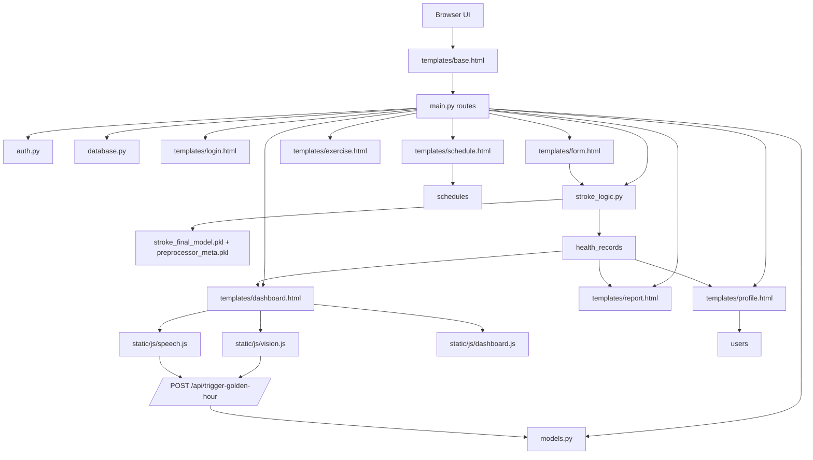
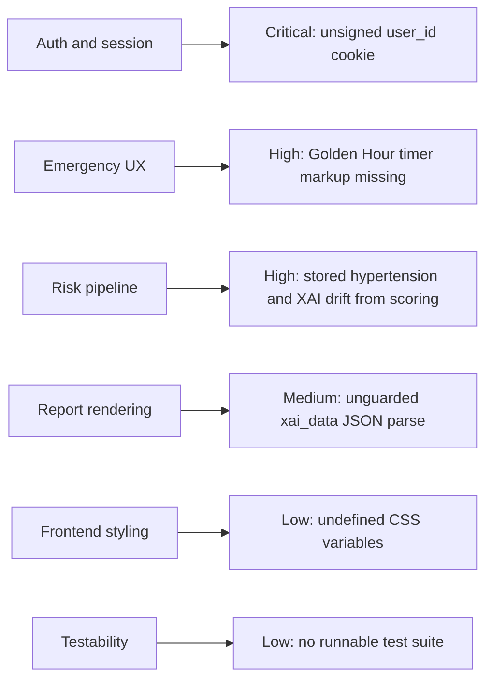

# Review Graph

Last updated: 2026-05-08
Project: HeartBits Dashboard
Status: review complete, skill installation skipped by user request

## System Graph

## Risk Graph

## Priority Queue

1. Fix auth/session handling in `main.py`.
2. Repair Golden Hour DOM and initialization in `templates/base.html`.
3. Align stored health record data and XAI inputs with the actual risk calculation in `main.py`.
4. Harden report rendering against malformed `xai_data`.
5. Clean CSS token usage and add a minimal test harness.

## Findings

### RG-001 Critical
Title: Session identity is trusted from a raw cookie
Files:
- `main.py:135`
- `main.py:188`
- `main.py:196`

Why it matters:
- Any client that can change `user_id` can impersonate another account.
- The cookie is not signed and does not set `secure` or `samesite`.

Recommended next step:
- Replace the raw ID cookie with a signed session or token-backed session.

### RG-002 High
Title: Golden Hour timer UI will break when emergency mode is active
Files:
- `templates/base.html:97`
- `templates/base.html:348`
- `templates/base.html:353`

Why it matters:
- The timer container is empty, but the script assumes `.progress-ring__circle` and `#timer-countdown` already exist.
- When `golden_hour_start` is set, `initGoldenHour()` will dereference missing DOM nodes.

Recommended next step:
- Add the missing timer markup or guard against absent elements before using them.

### RG-003 High
Title: Saved record data and XAI explanation do not match the score inputs
Files:
- `main.py:348`
- `main.py:360`
- `main.py:400`
- `main.py:422`
- `models.py:58`

Why it matters:
- The score uses same-day derived `hypertension`, but XAI uses `user.hypertension_history`.
- The `HealthRecord.hypertension` snapshot exists in the model but is never saved into `fields`.
- Users can see an explanation that does not describe the score they received.

Recommended next step:
- Persist same-day `hypertension` into the record and reuse the same feature row for scoring and XAI.

### RG-004 Medium
Title: Report page can 500 on malformed `xai_data`
Files:
- `main.py:572`

Why it matters:
- `dashboard` already treats `xai_data` as unsafe JSON, but `report` does not.
- One bad record can break the whole report page.

Recommended next step:
- Wrap JSON parsing in `try/except` and degrade gracefully when payloads are invalid.

### RG-005 Low
Title: CSS uses undefined design tokens
Files:
- `static/css/style.css:105`
- `static/css/style.css:116`
- `static/css/style.css:174`
- `static/css/style.css:568`
- `static/css/style.css:572`
- `static/css/style.css:721`

Why it matters:
- Several declarations rely on variables that are never defined: `--card-bg`, `--secondary`, `--primary-rgb`, `--text-main`, `--bg-app`.
- Styles fall back inconsistently and make UI behavior harder to predict.

Recommended next step:
- Replace these with existing tokens or define them at `:root`.

## Verification Notes

- `python -c "import main"` succeeds, but local startup currently depends on environment database configuration.
- `pytest` is not installed, and the repo does not contain a runnable automated test suite beyond synthetic data assets.

## Next Task Seeds

- Implement RG-001 before any new user-facing auth features.
- Implement RG-002 before relying on AI-triggered emergency flows.
- Implement RG-003 before tuning model weights, XAI, or report language.
- Add smoke tests for login, form submission, report rendering, and emergency mode after the fixes land.
